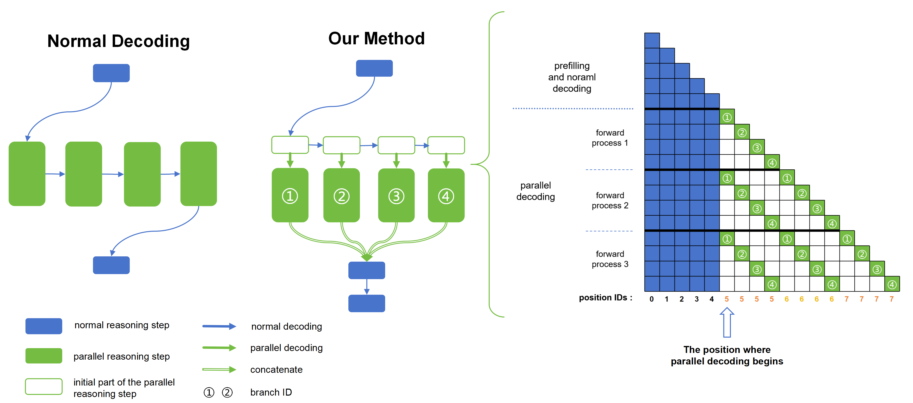

# Parallel Decoding wihtin One Sequence

To address the inefficiency of long reasoning, we leverage the inherent parallelizability of certain tasks to accelerate the reasoning process. 
Specifically, when multiple parallel reasoning branches exist, 
we decode multiple tokens per step using a specialized attention mask, processing them within a single sequence.




## Run Decoding

The experiment will run the same dataset with normal decoding and our parallel decoding method respectively, 
and record the output and decoding speed of them.
The results will be saved in the `results/{MODEL_NAME}` folder.

### Use Normal attention implementation

environment:
``
transformers>=4.49.0
torch>=2.5.0
``

To run our method with Qwen2 (or 2.5) models on the dataset of retrieval task
```bash
python generate.py --model_path <model_path> --task "retrieval"
```

To run our method with Qwen2 (or 2.5) models on the dataset of multi-document QA
```bash
python generate.py --model_path <model_path> --task "multi-document-qa"
```

To run our method with Qwen2 (or 2.5) models on the dataset of multi-branch planning
```bash
python generate.py --model_path <model_path> --task "planning"
```

### Use flash-attention-2

First, install the flash-attention-2 package of our modified version. 
```bash
cd flash-attention
python setup.py install
```

Then, run our method with Qwen2 (or 2.5) models on the dataset (such as the retrieval task) 
```bash
python generate.py --model_path <model_path> --task "retrieval" --attn_implementation "flash_attention_2"
```

## Run Evaluation

To compare the answer quality, average inference time and the decoding speed of our method and the baseline, 
you need to specify the dataset's path which records the output of the two methods in the `results/{MODEL_NAME}` folder, 
and the task type of the dataset. You also need to provide your openai API key, and the model name.
```bash
python eval.py --df_path <df_path> --task "retrieval" --api_key <api_key> --model_name "gpt-4o"
```
